- [1. Code](#1-code)
  - [1.1. run\_dense3D\_magfield](#11-run_dense3d_magfield)
    - [1.1.1. pipeline](#111-pipeline)
    - [1.1.2. dynModel](#112-dynmodel)
    - [1.1.3. domain\_cartesian\_dx](#113-domain_cartesian_dx)
    - [1.1.4. particleFilter](#114-particlefilter)
      - [1.1.4.1. ai](#1141-ai)
      - [1.1.4.2. xl](#1142-xl)
      - [1.1.4.3. particle](#1143-particle)
      - [1.1.4.4. how to use GP to predict](#1144-how-to-use-gp-to-predict)
      - [1.1.4.5. sequential process](#1145-sequential-process)
  - [1.2. run\_dense2D\_withHeading.m](#12-run_dense2d_withheadingm)
    - [1.2.1. map generation vs map prediction](#121-map-generation-vs-map-prediction)
  - [examples\\hilbert\_gp](#exampleshilbert_gp)
    - [how to predict? using covariance, or using coefficient of basis functions?](#how-to-predict-using-covariance-or-using-coefficient-of-basis-functions)
    - [](#)
- [Understanding the output](#understanding-the-output)
  - [](#-1)
  - [](#-2)
- [2. Q\&A](#2-qa)
  - [2.1. why does dynModel contain noise when predicting state?](#21-why-does-dynmodel-contain-noise-when-predicting-state)
  - [2.2. SS = dy\* P(:,:,i)\*dy' + R;](#22-ss--dy-pidy--r)
  - [LogSumExp](#logsumexp)
- [3. Issue](#3-issue)
  - [3.1. what is P\_mean?](#31-what-is-p_mean)
  - [3.2. Degeneracy Near Domain Boundary in 2D Hilbert-Reduced GP Approximation](#32-degeneracy-near-domain-boundary-in-2d-hilbert-reduced-gp-approximation)
  - [3.3. periodic nature in space](#33-periodic-nature-in-space)
- [4. Todo](#4-todo)
  - [4.1. compare smoother with filter](#41-compare-smoother-with-filter)
  - [4.2. try to understand the dynModel: does it contain anything related to angular velocity?](#42-try-to-understand-the-dynmodel-does-it-contain-anything-related-to-angular-velocity)
  - [4.3. 3.3](#43-33)

# 1. Code
## 1.1. run_dense3D_magfield
### 1.1.1. pipeline
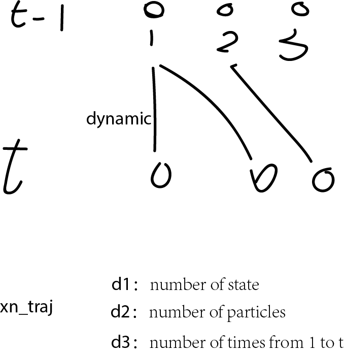
### 1.1.2. dynModel
```
    dynModel = @(xn,dx,dt,Q) [xn(1:2) + [cos(xn(3)), -sin(xn(3)) ; ...
                sin(xn(3)), cos(xn(3))]' * dx(1:2)' ; xn(3) + dx(3) + sqrt(Q) * randn]; 
```
### 1.1.3. domain_cartesian_dx
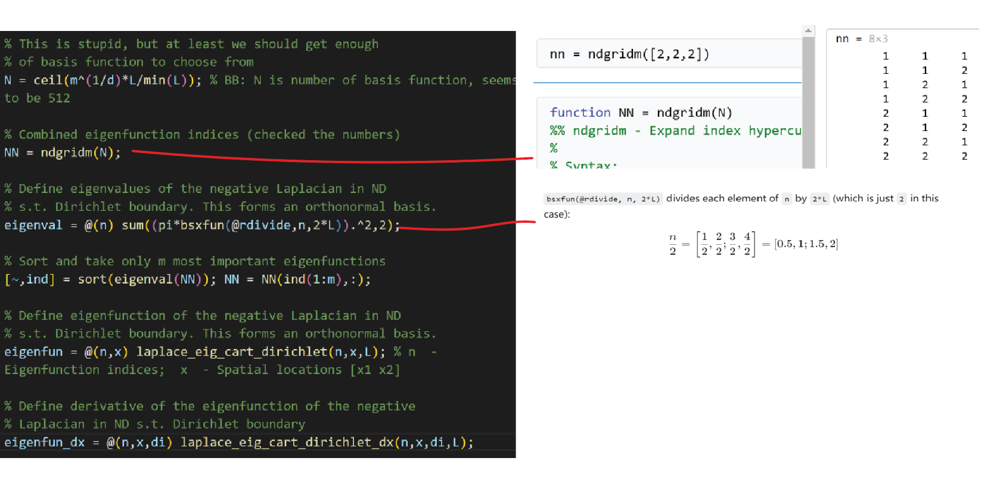
```
[eigenval,~,eigenfun_dx,NN] = domain_cartesian_dx(nBasisFunctions,d,LL);
```

```
domain_cartesian_dx - Laplace operator eigendecomposition in a hypercube
```
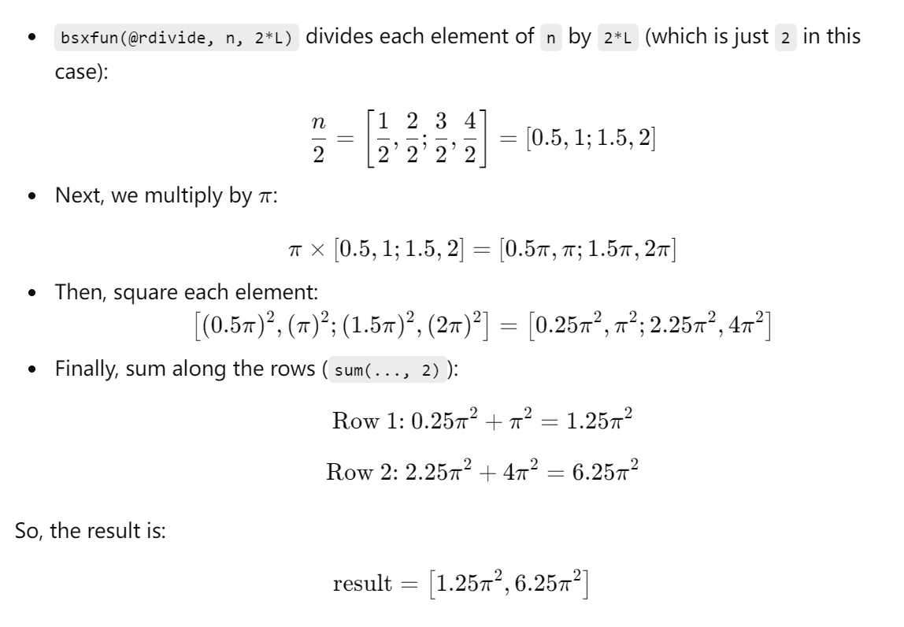

```
  eigenval = @(n) sum((pi*bsxfun(@rdivide,n,2*L)).^2,2);
```
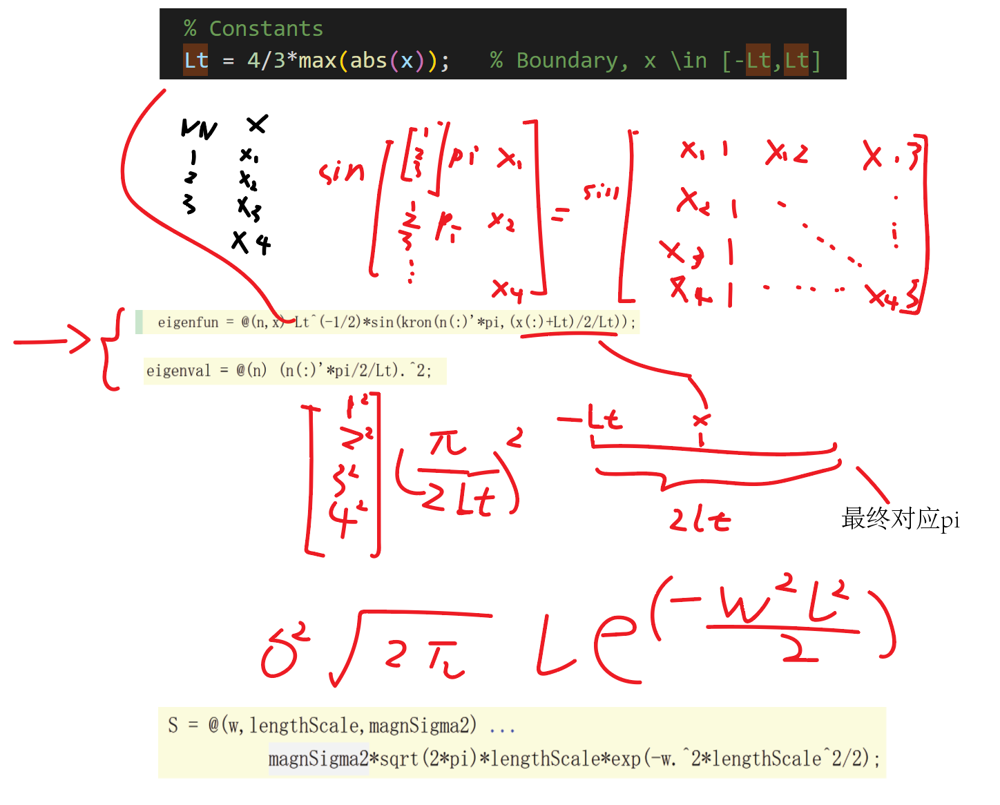

### 1.1.4. particleFilter
#### 1.1.4.1. ai
a means ancester
#### 1.1.4.2. xl
xl = xl(:,ai);
#### 1.1.4.3. particle
xn_traj = zeros(nNonLin, N_P, N_T); % Collection of all trajectories
#### 1.1.4.4. how to use GP to predict
#### 1.1.4.5. sequential process
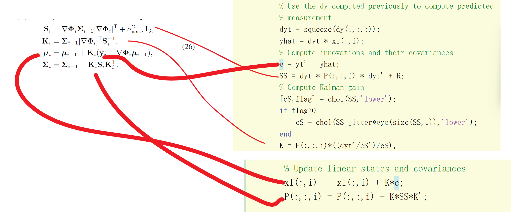

## 1.2. run_dense2D_withHeading.m
### 1.2.1. map generation vs map prediction
* map generation
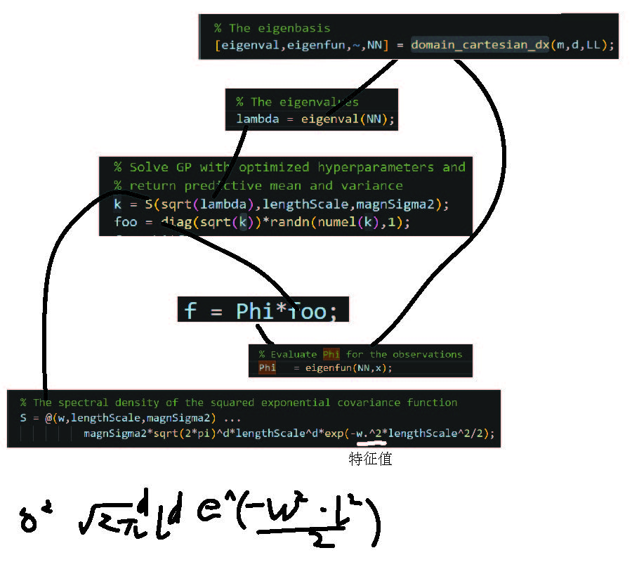

* map prediction
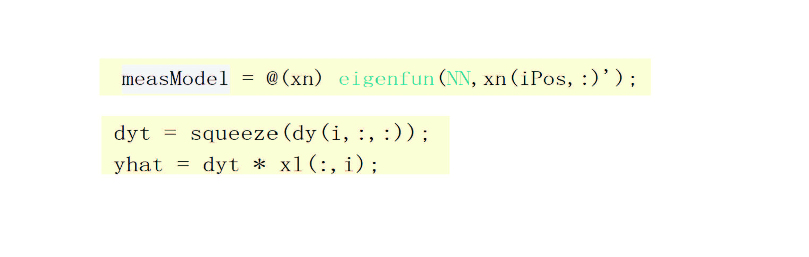

## examples\hilbert_gp
### how to predict? using covariance, or using coefficient of basis functions?
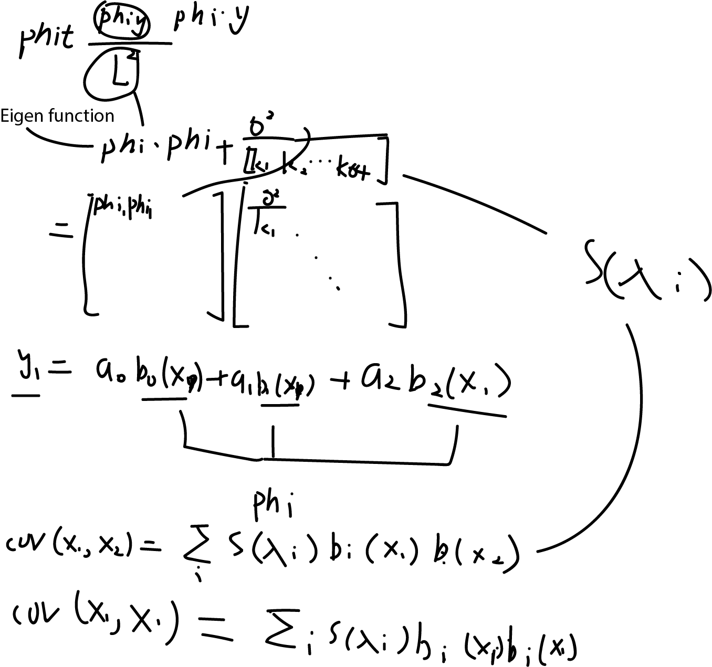
coefficients of sin functions are computed from covariance, unlike gaussian function's eigen values.

### 
# Understanding the output
## 

## 


# 2. Q&A
## 2.1. why does dynModel contain noise when predicting state?
At first I did not think it is good to use dynModel for propogate the state of particles, since it add some noise to the state, being so strange. However, now I accept that since the noise addition is how the pf gets its covariance or uncertainty.
## 2.2. SS = dy* P(:,:,i)*dy' + R;
dy is the derivative of measurement with respect to the map. The map containes 515 coefficients, including linear kernel and RBF kernel.
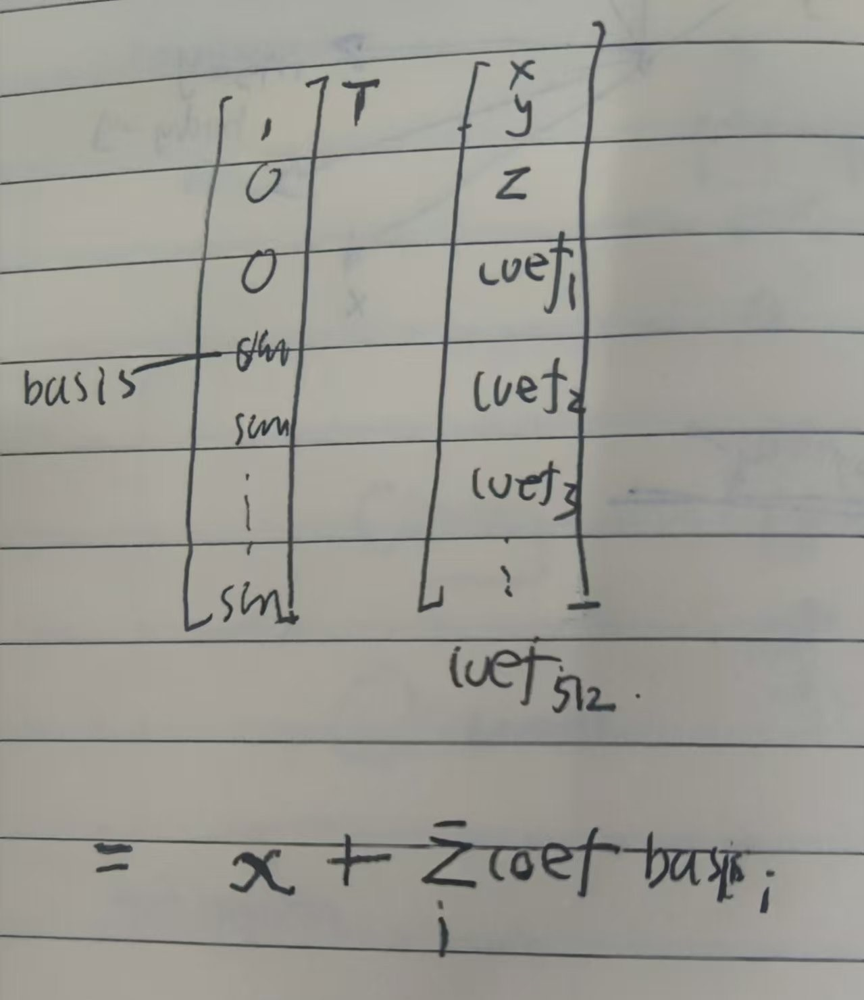

## LogSumExp

```
% Define input values
x = [1, 2, 3, 4]; % Example values of x_i
N = length(x);    % Number of elements

% Compute LSE (log-sum-exp)
LSE = log(sum(exp(x)));

% Calculate probabilities p_i
p = exp(x - LSE);

% Display results
disp('Values of p_i:');
disp(p);

% Verify that sum of p_i equals 1
disp('Sum of p_i:');
disp(sum(p));

p2 = exp(x) / sum(exp(x));
disp('p2 is '), disp(p2)

% Compute LSE (log-sum-exp)
c = max(x);
LSE = c + log(sum(exp(x - c)));

% Calculate probabilities p_i
p = exp(x - LSE);

% Display results
disp('Values of p_i:');
disp(p);

% Verify that sum of p_i equals 1
disp('Sum of p_i:');
disp(sum(p));


```

# 3. Issue
## 3.1. what is P_mean?
Subject: Questions Regarding State Covariance Calculation in Particle Filter Code

Dear Professor Manon Kok,

I am a student from Zhejiang University, and I have some questions regarding the following code in parcileFilter.m:
```
for i = 1:N_P
    P_mean = w(i) * ( P(:,:,i) + (xl_mean - xl(:,i)) * (xl_mean - xl(:,i))');
end
```
Here, P represents the state covariance of the 515 coefficients of the basis functions, which are regarded as linear states within the filter. 

In typical particle filters, P_mean  is usually calculated as follows:
```
    weighted_mean = sum(xn .* weights, 2);
    
    % Compute covariance of particles
    P_mean = zeros(size(xn, 1));
    for j = 1:N_P
        diff = xn(:,j) - weighted_mean;
        P_mean = P_mean + weights(j) * (diff * diff');
    end
```
I have a couple of concerns regarding your implementation:

* Variation with Particle Index: In your code, P_mean varies with the particle index i, which seems unusual. Could you clarify the reasoning behind this approach?

* Addition of P(:,:,i): Additionally, I am curious why (xl_mean - xl(:,i)) * (xl_mean - xl(:,i))' adds P(:,:,i). This appears to differ from the typical formulation used in particle filters.

Thank you for your time and assistance.

Best regards,
Bingbing
zhangbb.john@gmail.com

## 3.2. Degeneracy Near Domain Boundary in 2D Hilbert-Reduced GP Approximation
``` 
Dear Professor Monon Kok,

I am a PhD student from Zhejiang University. Recently, I have been testing the 2D Hilbert-reduced Gaussian Process (GP) model and encountered an issue related to degeneracy near the boundary of the domain.

Specifically, when computing the covariance between two points x1 and x2, where:

* x1 is fixed,
* x2 varies over the domain,

I observed the following behavior:

If x1 is set near the boundary of the domain, the approximation using the sum of weighted sine functions degenerates, leading to a large error.


However, when x1 is far from the boundary, i.e., near the center of the domain, the error of approximation becomes significantly smaller.


# Question
Is this behavior consistent with your expectations for the 2D Hilbert-reduced GP approximation?

# Request
Could you provide any suggestions or insights to address this issue? I would greatly appreciate guidance on mitigating the degeneracy near the domain boundary.

# Appendix

The related code can be found in [test_reduced_rank_gp_2d.m](https://github.com/zhangbb-john/Rao-Blackwellized-SLAM-smoothing/blob/main/examples/hilbert_gp/test_reduced_rank_gp_2d.m).

Thank you for your time and consideration.

Best regards,
Bingbing Zhang
PhD Student, Zhejiang University
Email: [zhangbb.john@gmail.com] 
```
## 3.3. periodic nature in space 
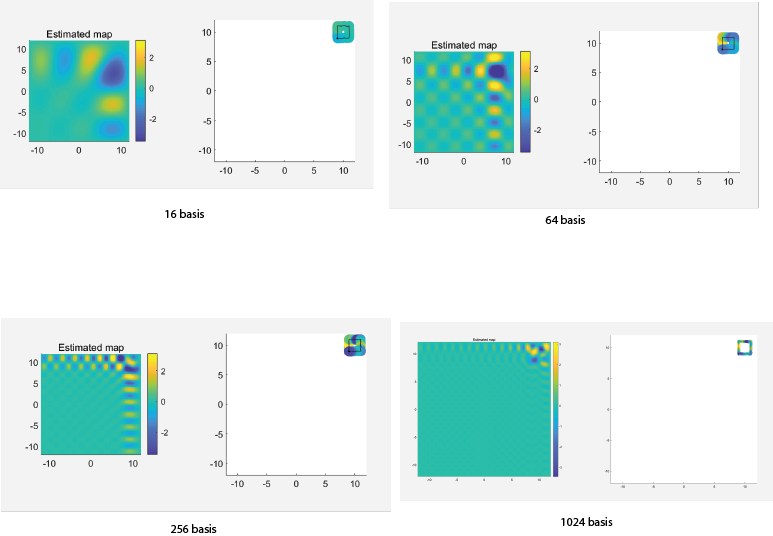

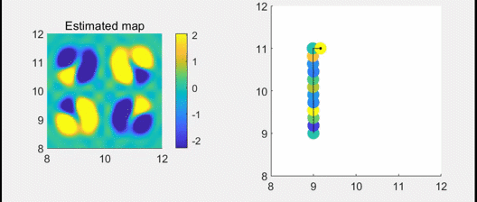


# 4. Todo
## 4.1. compare smoother with filter

## 4.2. try to understand the dynModel: does it contain anything related to angular velocity?

## 4.3. 3.3